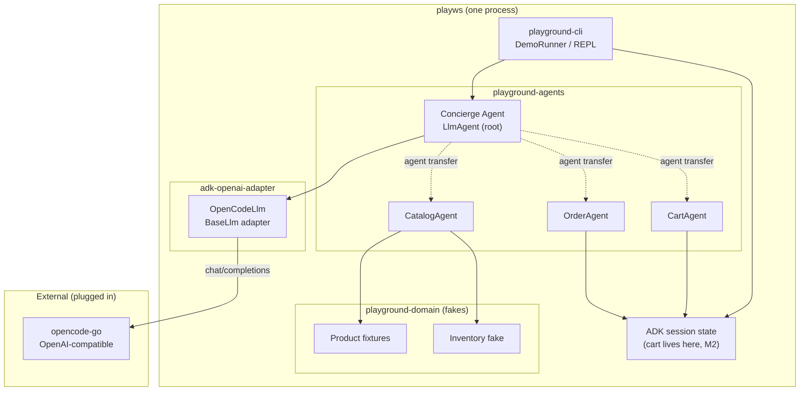
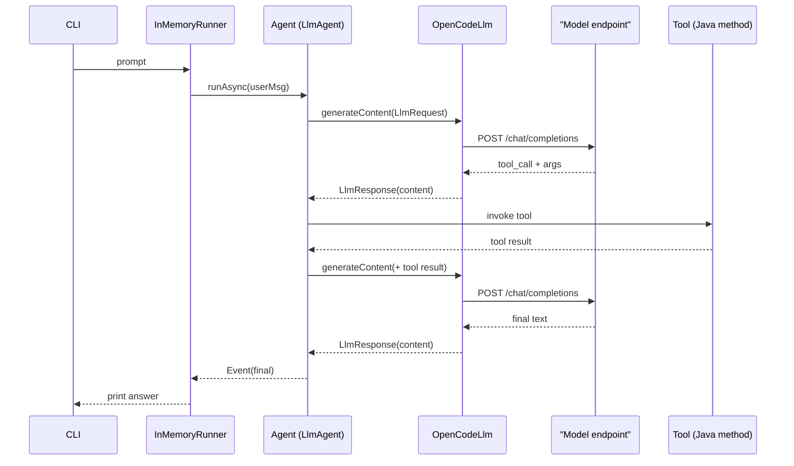

# playws

A small, public playground for practicing **AI agents with Google ADK (Java)**.
It runs a real agent against any OpenAI-compatible endpoint through a hand-written
`BaseLlm` adapter, and grows into a YAS-inspired *e-commerce assistant* — the
**domain is a background idea, not a goal**.

- Built on `com.google.adk:google-adk:1.10.1`, Java 17 (toolchain JDK 21), Maven — one
  executable from four modules (modular monolith).
- Adapter (`OpenCodeLlm`) proves the LLM boundary: no Gemini key required.
- Its real deliverable is a **table of what works on small models and how much
  guardrails help** — not a shop.

> Background idea: [nashtech-garage/yas](https://github.com/nashtech-garage/yas)
> (a Java microservices e-commerce sample). We borrow only its **nouns**
> (Product, Cart, Order, Inventory, Rating), never its infrastructure.

## Current state (M0)

Honest snapshot — two of the four modules are empty skeletons, and the diagrams
below show the **target** shape, not today's.

- **Exists:** `adk-openai-adapter` (`OpenCodeLlm` + `config/Env`), and a single
  `DemoAgent`/`DemoRunner` in `playground-cli` that calls the model as plain text.
- **Empty (planned):** `playground-domain`, `playground-agents` — no code yet.
- **Not implemented:** tool calling, multi-agent routing, cart/order, evals. The
  adapter sends text and reads text only; `DemoAgent` registers no tools.
- `DemoAgent` still lives in `playground-cli` (it will move to `playground-agents`
  and take an injected `BaseLlm` at M1).

## Status

| Milestone | Goal | State |
|---|---|---|
| M0 | Harden the LLM adapter (tool-call round trip) | in progress |
| M1 | Read-only catalog agent + eval scaffold | planned |
| M2 | Cart / session state | planned |
| M3 | Multi-agent routing | planned |
| M4 | Guardrails + human-in-the-loop | planned |
| M5 | Optional: RAG reviews / enrichment loop / big-model compare | planned |
| M6 | Optional: expose catalog/cart via an MCP server (deferred; see ADR-0001) | deferred |

## Architecture

The project is a **modular monolith**, one executable built from four Maven
modules split by dependency boundary (see [`docs/adr/0001-module-structure.md`](docs/adr/0001-module-structure.md)).
The `domain` and `agents` boundaries are enforced by the build (`maven-enforcer-plugin`);
the adapter's "no internal deps" rule is convention for now (see ADR-0001).

```
playws-parent
├── adk-openai-adapter   OpenCodeLlm + config/Env -> OpenAI-compatible endpoint (deps: ADK + dotenv-java)
├── playground-domain    catalog/cart/order rules + in-memory fakes (no ADK, no internal deps)
├── playground-agents    agent factories, tools, routing, guardrails (adapter banned; model injected)
└── playground-cli       CLI, session service, composition root, shaded jar (the one executable)
```

Dependency graph: `cli -> agents -> domain` and `cli -> adapter`. Nothing else.
Domain and agents boundaries are **enforced by the build** (enforcer `bannedDependencies`);
the adapter's "no internal deps" rule is convention for now (not yet enforced).

The agent layer stays thin; the LLM boundary is swappable and the "services"
are in-memory fakes — **no HTTP between services**. (One documented exception:
optional M6 may expose catalog/cart over an **MCP server** as a real process
boundary — see ADR-0001.)

> The two diagrams below show the **target (M1+)** architecture, not the M0
> skeleton. See "Current state" above.



### Request flow (single turn) — target, includes tool calling (M0/M1)

> Today's adapter does **not** send `tools` or parse `tool_calls`; this is the M0 goal.



## Run it

```bash
# 1. toolchain (installed locally, no sudo)
export JAVA_HOME=~/.local/opt/jdk-21.0.12.1+1
export PATH="$HOME/.local/opt/apache-maven-3.9.9/bin:$JAVA_HOME/bin:$PATH"

# 2. config
cp .env.example .env         # then edit OPENCODE_API_KEY

# 3. run a single prompt
mvn -q -B package -DskipTests
java -jar playground-cli/target/playground-cli-*.jar "What is Google ADK? One sentence."
```

## Layout

```
playws/
  pom.xml                            # parent (packaging=pom) + dependencyManagement
  Dockerfile  docker-compose.yml     # thin-client image + optional 'local' Ollama profile
  .env.example                       # copy to .env (gitignored)
  adk-openai-adapter/                # BaseLlm adapter to an OpenAI-compatible endpoint
    src/main/java/com/playws/config/Env.java
    src/main/java/com/playws/llm/openai/OpenCodeLlm.java
  playground-domain/                 # plain-Java domain (empty at M0; ADK banned)
  playground-agents/                 # agent factories/tools (empty at M0; adapter banned)
  playground-cli/                    # the one executable
    src/main/java/com/playws/cli/{DemoAgent,DemoRunner}.java
  eval-out/                          # live-eval results (gitignored)
  docs/
    VISION.md  ROADMAP.md  ARCHITECTURE.md  TECHNICAL-NOTES.md  IDEAS.md
    adr/0001-module-structure.md
```

## Non-goals

Written down on purpose, so this never becomes an unfinished YAS clone:

- No Spring Boot, no microservices, no HTTP between services (the only allowed
  process split is the optional MCP server in ADR-0001).
- No Kafka, Elasticsearch, Keycloak, Kubernetes, or Grafana.
- No frontend — CLI only.
- No copying YAS code or schemas.
- Stay on Java 17 (`release=17`, toolchain JDK 21) + plain Maven. Modules split by
  **dependency boundary**, never service-per-domain (see ADR-0001); a new agent is a
  package, not a module.

## Design rules

1. **Behaviour test** — a feature is allowed only if it changes how the *agent*
   behaves (a checkout the agent must confirm passes; a "realistic" checkout fails).
2. **Fakes, not services** — the domain stays fixtures + ~200 lines of fake code.
3. **Eval-gated** — no milestone is done without a runnable demo and a pass-rate table.
4. **Parking lot** — anything deferred goes to `docs/IDEAS.md`.

## License

MIT (to be added).
