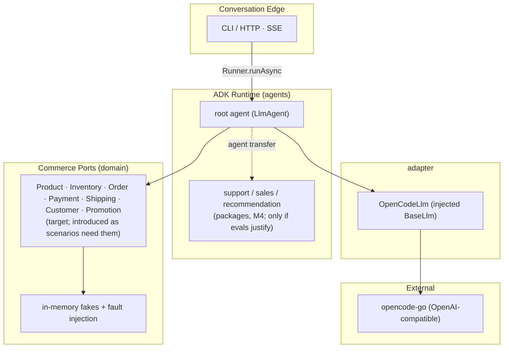
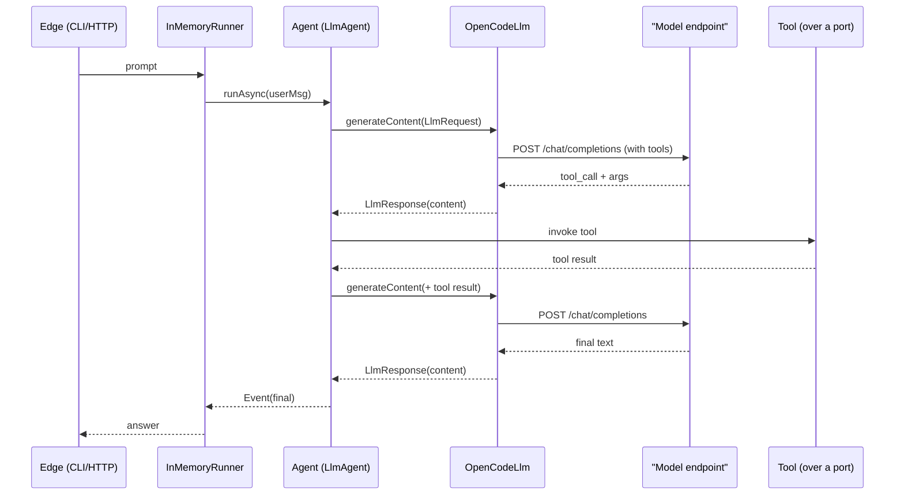

# playws

A working **reference and lab for conversational commerce built on Google ADK (Java)**.
It runs a real agent against any OpenAI-compatible endpoint through a hand-written
`BaseLlm` adapter, and grows **outward from the agent core** — a correct adapter, a tested
agent, a thin conversation edge, grounded commerce tools, safe actions, then justified
specialization. It is **not a store**; in-memory fakes are first-class fixtures.

- Built on `com.google.adk:google-adk:1.10.1`, Java 17 (toolchain JDK 21), Maven — a
  modular monolith split by **dependency boundary** (ADR-0001).
- Its deliverable is an **executable, evaluated reference** (deterministic tests + a
  measured live-model eval), not a shop.

> Background idea: [nashtech-garage/yas](https://github.com/nashtech-garage/yas)
> (a Java microservices e-commerce sample). We borrow only its **nouns**
> (Product, Inventory, Order, Payment, Shipping, Customer, Promotion) — as **ports**, never
> its infrastructure.

## Current state (M0)

Honest snapshot — two of the four modules are empty skeletons, and the diagrams below show
the **target** shape, not today's.

- **Exists:** `adapter` (`OpenCodeLlm` + `config/Env`), and a single `DemoAgent`/
  `DemoRunner` in `cli` that calls the model as plain text.
- **Empty (planned):** `domain`, `agents` — no code yet.
- **Not implemented:** tool calling, commerce ports, the edge, eval. The adapter sends and
  reads text only; `DemoAgent` registers no tools.
- `DemoAgent` moves to `agents` with an injected `BaseLlm` at M1.

## Status

Milestones exit on **demonstrated behaviour (evals), not features** — see
[`docs/ROADMAP.md`](docs/ROADMAP.md).

| Milestone | Goal | State |
|---|---|---|
| M0 | Correct tool-call round trip in the adapter | in progress |
| M1 | Read-only shopper (ports + fakes + testkit) | planned |
| M2 | Safe commerce actions (two-phase confirm) | planned |
| M3 | Conversation edge (HTTP + SSE) | planned |
| M4 | Evaluated specialization (only if evals justify) | planned |
| M5 | Reproducible reference (replay + conformance; optional MCP) | planned |

## Architecture

One process per executable. **Four Maven modules today** (`adapter`, `domain`, `agents`,
`cli`); `testkit` joins at M1, `web` at M3, `mcp-server` optional at M5. Split by
dependency boundary (ADR-0001). `domain`/`agents` bans are enforced by the build today;
ArchUnit edge rules are planned (M1/M3).

```
playws-parent
├── adapter   OpenCodeLlm + config/Env -> OpenAI-compatible endpoint (ADK + dotenv)
├── domain    commerce model + PORTS + in-memory fakes (no ADK, no internal deps)
├── agents    agent factories, tools, routing, guardrails (adapter banned; model injected)
├── cli       CLI composition root, shaded jar (the executable now)
├── web       Spring Boot HTTP/SSE composition root (M3; ADR-0002)
└── testkit   ScriptedLlm / record-replay / fixtures (test scope only)
```

Dependency graph: `cli → agents → domain`, `cli → adapter, domain`; at M1 `testkit → domain`
(test scope); at M3 `web → agents, adapter, domain`. `testkit` does not depend on `agents`.
`mcp-server` (optional, M5) → `domain`.

The agent layer stays thin. **There is no separate "AI Orchestrator":** intent, context,
model choice and routing belong to ADK (ADR-0003). The layers are:

```
Channels → Conversation Edge (cli/web) → ADK Runtime (agents) → Commerce Ports (domain) → Fakes
```



### Request flow (single turn, with tool calling — target)

> Today's adapter does **not** send `tools` or parse `tool_calls`; this is the M0 goal.



## Run it

```bash
# 1. toolchain (installed locally, no sudo)
export JAVA_HOME=~/.local/opt/jdk-21.0.12.1+1
export PATH="$HOME/.local/opt/apache-maven-3.9.9/bin:$JAVA_HOME/bin:$PATH"

# 2. config
cp .env.example .env         # then edit OPENCODE_API_KEY

# 3. run a single prompt
mvn -q -B package -DskipTests
java -jar cli/target/cli-*.jar "What is Google ADK? One sentence."
```

## Layout

```
playws/
  pom.xml                            # parent (packaging=pom) + dependencyManagement
  Dockerfile  docker-compose.yml     # thin-client image + optional 'local' Ollama profile
  .env.example                       # copy to .env (gitignored)
  adapter/                           # BaseLlm adapter + config/Env
  domain/                            # commerce ports + in-memory fakes (ADK banned)
  agents/                            # agents/tools/routing (adapter banned; model injected)
  cli/                               # CLI composition root (the executable now)
  eval-out/                          # live-eval results (gitignored)
  docs/
    VISION.md  ROADMAP.md  ARCHITECTURE.md  TECHNICAL-NOTES.md  IDEAS.md
    adr/0001..0004-*.md   specs/m0-tool-call-round-trip.md
```

## Non-goals

- No microservices, no HTTP between services. Allowed process splits: the HTTP edge
  (ADR-0002) and an optional MCP server (ADR-0001).
- No Kafka, Elasticsearch, Keycloak, Kubernetes, or Grafana.
- No frontend — CLI + HTTP API; no web UI.
- No copying YAS code or schemas. Commerce nouns are **ports**, not services.
- Stay on Java 17 (`release=17`, toolchain JDK 21) + plain Maven. Modules split by
  **dependency boundary**, never service-per-domain; a new agent is a **package**.
- **No "AI Orchestrator"** — ADK owns intent/context/routing (ADR-0003).

## Design rules

1. **Behaviour test** — a feature is allowed only if it changes how the *agent* behaves.
2. **Fakes, not services** — the domain stays ports + in-memory fakes with fault injection.
3. **Eval-gated** — no milestone is done without a runnable scenario and a measured result.
4. **Propose vs commit** — side-effecting tools are two-phase (ADR-0004).
5. **Parking lot** — anything deferred goes to `docs/IDEAS.md`.

## License

MIT (to be added).
