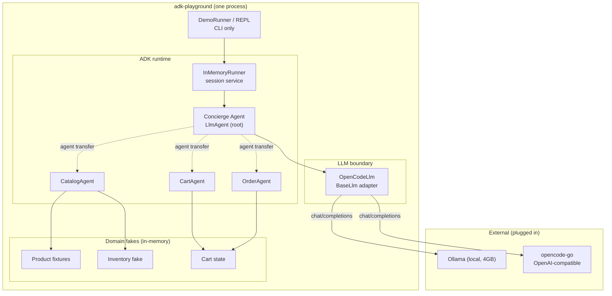
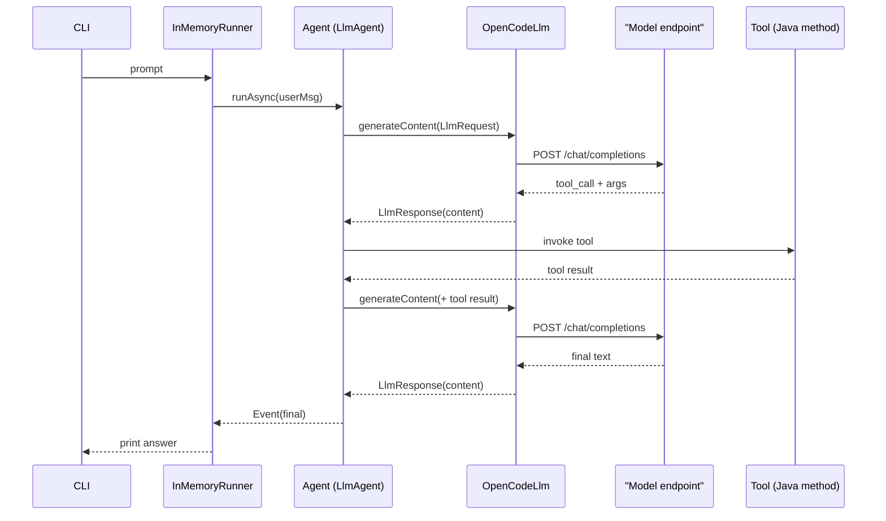

# adk-playground

A small, public playground for practicing **AI agents with Google ADK (Java)**.
It runs a real agent against any OpenAI-compatible endpoint through a hand-written
`BaseLlm` adapter, and grows into a YAS-inspired *e-commerce assistant* — the
**domain is a background idea, not a goal**.

- Built on `com.google.adk:google-adk:1.10.1`, Java 21, Maven, one module.
- Adapter (`OpenCodeLlm`) proves the LLM boundary: no Gemini key required.
- Its real deliverable is a **table of what works on small models and how much
  guardrails help** — not a shop.

> Background idea: [nashtech-garage/yas](https://github.com/nashtech-garage/yas)
> (a Java microservices e-commerce sample). We borrow only its **nouns**
> (Product, Cart, Order, Inventory, Rating), never its infrastructure.

## Status

| Milestone | Goal | State |
|---|---|---|
| M0 | Harden the LLM adapter (tool-call round trip) | in progress |
| M1 | Read-only catalog agent + eval scaffold | planned |
| M2 | Cart / session state | planned |
| M3 | Multi-agent routing | planned |
| M4 | Guardrails + human-in-the-loop | planned |
| M5 | Optional: RAG reviews / enrichment loop / big-model compare | planned |

## Architecture

The agent layer stays thin; the LLM boundary is swappable and the "services"
are in-memory fakes — no HTTP between services, ever.



### Request flow (single turn)



## Run it

```bash
# 1. toolchain (installed locally, no sudo)
export JAVA_HOME=~/.local/opt/jdk-21.0.12.1+1
export PATH="$HOME/.local/opt/apache-maven-3.9.9/bin:$JAVA_HOME/bin:$PATH"

# 2. config
cp .env.example .env         # then edit OPENCODE_API_KEY

# 3. run a single prompt
mvn -q compile exec:java -Dexec.mainClass=com.workshop.adkplayground.DemoRunner \
  -Dexec.args="What is Google ADK? One sentence."
```

## Layout

```
adk-playground/
  pom.xml                        # google-adk 1.10.1 + dotenv-java
  .env.example                   # copy to .env (gitignored)
  src/main/java/com/workshop/adkplayground/
    Env.java                     # .env + process-env config resolution
    OpenCodeLlm.java             # BaseLlm -> OpenAI-compatible endpoint
    DemoAgent.java               # LlmAgent on OpenCodeLlm
    DemoRunner.java              # one-shot CLI runner
  docs/
    VISION.md  ROADMAP.md  ARCHITECTURE.md  TECHNICAL-NOTES.md  IDEAS.md
```

## Non-goals

Written down on purpose, so this never becomes an unfinished YAS clone:

- No Spring Boot, no microservices, no HTTP between services, no Docker Compose.
- No Kafka, Elasticsearch, Keycloak, Kubernetes, or Grafana.
- No frontend — CLI only.
- No copying YAS code or schemas.
- Stay on Java 21 + plain Maven, one module.

## Design rules

1. **Behaviour test** — a feature is allowed only if it changes how the *agent*
   behaves (a checkout the agent must confirm passes; a "realistic" checkout fails).
2. **Fakes, not services** — the domain stays fixtures + ~200 lines of fake code.
3. **Eval-gated** — no milestone is done without a runnable demo and a pass-rate table.
4. **Parking lot** — anything deferred goes to `docs/IDEAS.md`.

## License

MIT (to be added).
